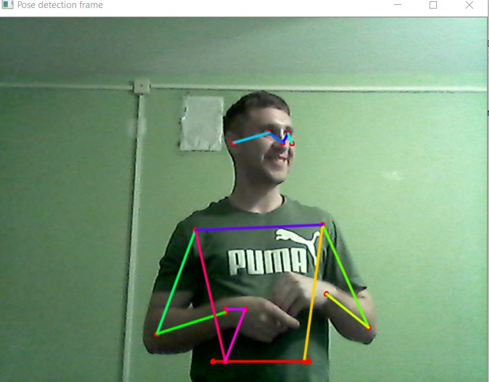

# Pose estimation

## Overview

Репозиторий содержит примеры использования двух библиотек по определению позы человека: mediapipe и torchvision. Оценка позы происходит в real-time формате с использованием веб-камеры ноутбука/компьютера.

## Results

Примеры работы модели torchvision:

Пример работы mediapipe:

